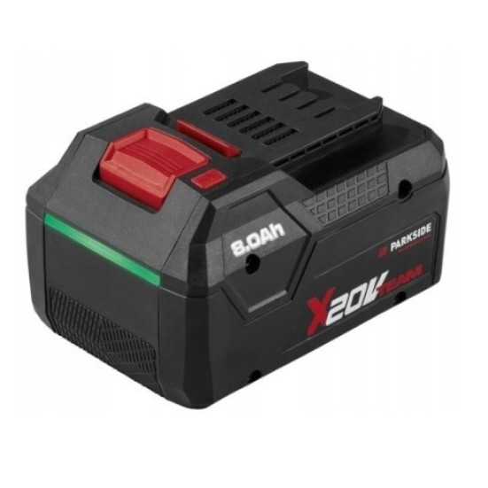

# Tuya BLE → ESPHome

Read datapoints (sensor values) from Bluetooth-only Tuya devices directly on
an ESP32, as native ESPHome `sensor`/`binary_sensor` entities — no Tuya
cloud, no Home Assistant integration, no hub required at runtime.

This exists for the class of Tuya devices that only speak Bluetooth LE and
have no Wi-Fi/LAN presence at all — the kind that Tuya's own app can only
reach directly, and that most "local" integrations (which assume a LAN IP)
can't touch. If your device shows up in the Tuya app but has no IP address
anywhere in its Cloud API record, this is probably what you're looking for.

**If this is your first time doing anything like this:** read this file top
to bottom before writing any YAML. The hardest part of this whole project
isn't the ESPHome config — it's obtaining one specific 16-character secret
correctly, and skipping that understanding is exactly how you end up
debugging a BLE "protocol bug" for hours that's actually a wrong credential.
See [`docs/getting-the-local-key.md`](docs/getting-the-local-key.md) — read
it before you flash anything.

## Tested hardware

This has been confirmed working end-to-end against a real device:

| | |
|---|---|
| Manufacturer | PARKSIDE (Lidl's in-house power tool brand) |
| Model | PAPP-208-A1, "X20V Team" cordless battery system |
| Capacity | 20V / 8.0Ah |
| Tuya category | `dcb` (Smart Battery 20V/8Ah) |
| Tuya `product_id` | `r04rvmaq` |



Confirmed-working datapoints, with a real example reading pulled live over
BLE during testing:

| DP ID | Name | Example live value |
|---|---|---|
| 16 | `battery_percentage` | 67 % |
| 11 | `temp_current` | 25 °C |
| 2 | `charge_current` | 0 mA (idle, not charging) |
| 3 | `charge_voltage` | raw `18363` → 18.36 V (raw value is mV directly, see note below) |
| 12 | `upper_temp_switch` | `false` |
| 8 | `charge_times` | 6 |
| 9 | `discharge_times` | 38 |

**Note on `charge_voltage`:** Tuya's own DP metadata for this field specifies
a `scale` value that, taken literally, would put the reading in the
implausible ~1-2V range. The confirmed-correct reading treats the raw
integer as millivolts directly, ignoring the `scale` field. This was only
resolved by comparing a live decoded value against physical plausibility —
don't trust either interpretation for your own device until you've done the
same.

The device also reports a number of additional, undocumented DPs (in the
100s range) that haven't been mapped to a meaning yet — visible in the debug
log, not required for the sensors above.


## Why this needs its own component at all

ESPHome doesn't support Tuya's BLE protocol natively. Tuya devices encrypt
essentially everything (AES-128-CBC, keyed per-device) once you're past the
initial GATT connection, so "just connect to it" isn't enough — you need to
speak Tuya's specific framing, encryption, and datapoint (DP) format on top
of plain BLE. That's what the `external_components` in this repo do. They're
a fork of [`BillyNate/esphome-tuya-ble`](https://github.com/BillyNate/esphome-tuya-ble)
(which handles pairing and encrypted transport, but only drives a single
on/off output) extended to decode arbitrary datapoints into real ESPHome
sensors, plus several fixes for API changes in current ESPHome versions and
one real protocol bug (a missing notification-enable step). See
[`docs/architecture.md`](docs/architecture.md) for the full protocol
walkthrough and exactly what was added/fixed and why.

## Quickstart

1. **Get your device's identifiers and a working `local_key`.**
   This is the part that takes real effort — read
   [`docs/getting-the-local-key.md`](docs/getting-the-local-key.md) in full.
   Skipping straight to step 2 with a key you haven't verified is the single
   most common way to burn hours on this.

2. **Set up your config.**
   ```bash
   cp example_config.yaml my-device.yaml
   cp secrets.yaml.example secrets.yaml
   ```
   Fill in `secrets.yaml` with the values from step 1, plus your Wi-Fi
   credentials and an API encryption key (`esphome` can generate one for
   you, or use any 32-byte base64 string).

3. **Find your device's actual datapoint (DP) schema.**
   The example config's `sensor:`/`binary_sensor:` entries match one
   specific "Smart Battery" style product. Yours will differ. Two ways to
   find your own DP IDs:
   - The Tuya IoT Platform's **Specifications** tab for your linked
     product shows the official DP table (ID, name, type, range).
   - Flash with just the `tuya_ble_node:` block and no sensors yet, watch
     the logs at `DEBUG` — every DP the device reports gets logged (tag
     `tuya_ble_dp`) with its raw bytes, whether or not you've mapped it to
     anything yet. This is often faster than digging through the cloud
     console, and it's the only way to see truly undocumented DPs.

4. **Flash and verify.**
   ```bash
   esphome run my-device.yaml
   ```
   Watch for: BLE discovery of your device, a successful GATT connect,
   pairing (if you configured `device_id`/`uuid`), and then DP values
   appearing in the log. If it pairs but nothing arrives, or it connects and
   then disconnects after ~15-30 seconds, see
   [`docs/troubleshooting.md`](docs/troubleshooting.md) — both of those have
   specific, previously-diagnosed causes.

5. **Cross-check your first live values against a known-good source**
   (the Tuya/Smart Life app, or the Cloud API) before trusting them. DP
   scale/unit metadata from Tuya's docs is not always reliable — this
   project hit a real case where a "scale" field in the official spec was
   simply wrong for one DP. Trust a decoded value only once you've compared
   it against something you already know to be true.

## What's in this repo

```
components/            ESPHome external_components (the actual C++/Python)
  tuya_ble_tracker/     BLE scanning, filters to configured MACs
  tuya_ble_client/      GATT connection, encryption, pairing state machine
  tuya_ble_node/        per-device state + sensor/binary_sensor/output platforms
example_config.yaml     a working example — copy and adapt
secrets.yaml.example    template for the file example_config.yaml expects
tools/get_local_key.py  fetches a real local_key via Tuya's mobile-app API
docs/
  getting-the-local-key.md   the hard part — read this first
  architecture.md             how the protocol and the component work
  troubleshooting.md          symptom → cause → fix, from real bring-up
```

## Safety notes

- Treat `local_key`, `device_id`, `uuid`, and your device's MAC as secrets.
  `secrets.yaml` is git-ignored for this reason — don't commit real values,
  don't paste them into issue trackers or chat tools.
- If your device has any write-capable DPs (anything that can change a
  physical state — a switch, a relay, a safety cutoff), don't toggle one you
  haven't confirmed the real-world meaning of. Read-only sensor DPs are safe
  to explore freely; write DPs are not something to probe by trial and
  error.

## Credits / prior art

- [`BillyNate/esphome-tuya-ble`](https://github.com/BillyNate/esphome-tuya-ble) —
  the base this repo extends (pairing, encrypted transport).
- [`PlusPlus-ua/ha_tuya_ble`](https://github.com/PlusPlus-ua/ha_tuya_ble) and
  the actively maintained
  [`ha-tuya-ble/ha_tuya_ble`](https://github.com/ha-tuya-ble/ha_tuya_ble) —
  Home Assistant integration for the same protocol family; used here to
  cross-check the protocol byte-for-byte, and the source of the
  protocol-v2/`secKey` reference (PR #255) mentioned in the docs.
- [`hms-homelab/hms-esp-tuya-ble`](https://github.com/hms-homelab/hms-esp-tuya-ble) —
  independent ESP-IDF firmware for the same protocol; also used to
  cross-check the implementation.
- [`AboveColin/tuya-mobile`](https://github.com/AboveColin/tuya-mobile) —
  the pure-Python mobile-app API client this repo's `tools/get_local_key.py`
  is built on.

## License

MIT + GPLv3 dual license, matching the upstream ESPHome/`esphome-tuya-ble`
license this repo's `components/` are forked from — see [`LICENSE`](LICENSE).
